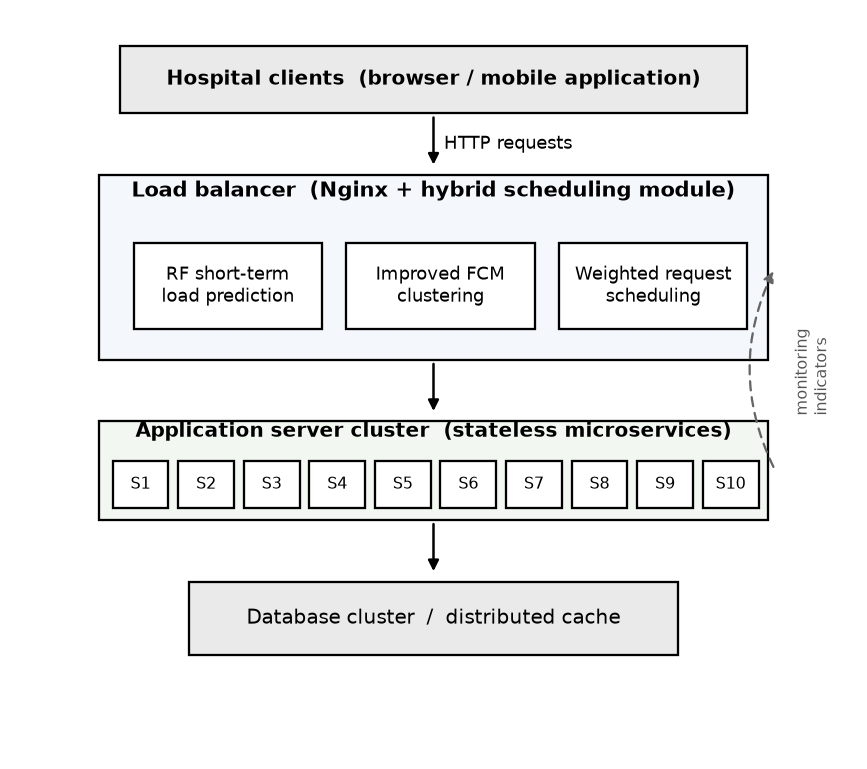
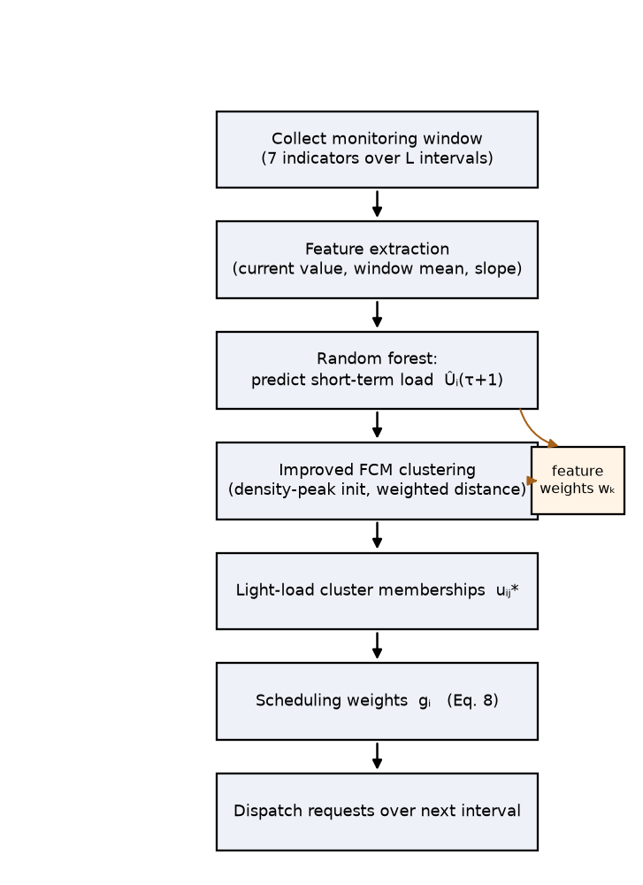
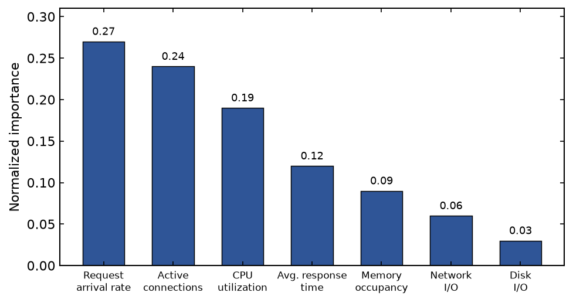
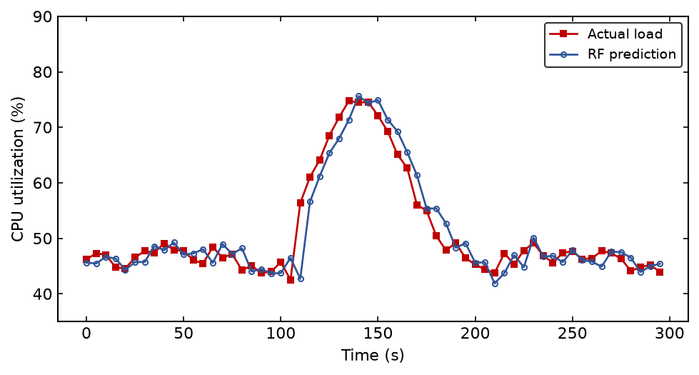
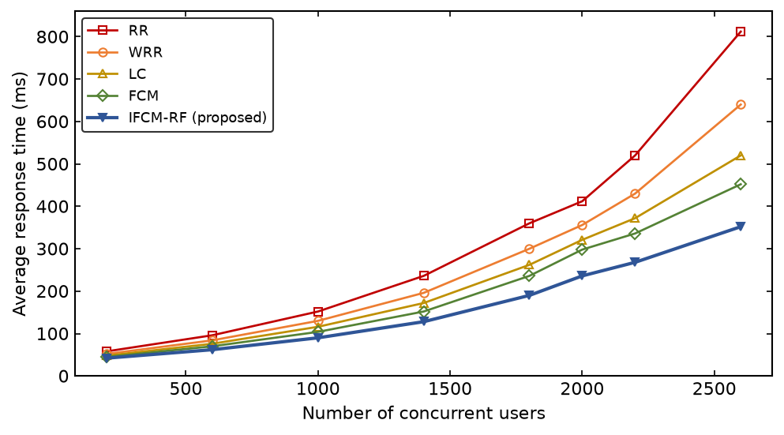
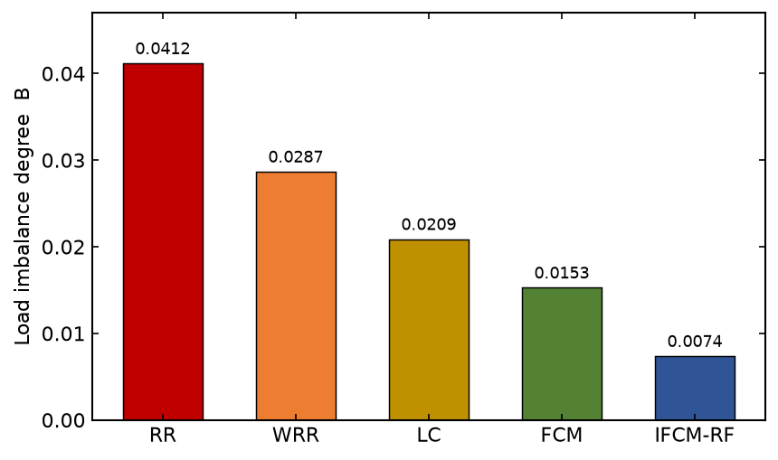

# A hybrid short-term server load balancing approach based on improved fuzzy c-means clustering and random forest method in medical supplies management web service system

Haoran Wu^a^, Lijuan Feng^a,\*^, Zhenyu Qiao^b^, Xiaoming Deng^a^

^a^ School of Computer and Information Engineering, Huadong University of Technology, Nanjing 210094, China
^b^ Information Center, East Jiangsu Regional Medical Supplies Service Platform, Nanjing 210000, China

\* Corresponding author. E-mail address: fenglijuan@hdut.edu.cn (L. Feng).

## Abstract

The medical supplies management web service system undertakes procurement, warehousing and distribution requests from a large number of hospitals, and its traffic is highly bursty because purchasing activities are concentrated in a few periods of the working day. Under such a workload, conventional load balancing algorithms that rely only on the current state of the servers, such as round robin and least connection, tend to react too late, so that some nodes are overloaded while others stay idle and the response time of the whole cluster deteriorates. To alleviate this problem, a hybrid short-term load balancing approach that combines an improved fuzzy c-means (IFCM) clustering algorithm with the random forest (RF) method is proposed in this paper. The random forest model is first used to predict the short-term load of every application server from a sliding window of monitoring indicators, and the importance scores it produces are then reused to weight the features of the fuzzy c-means algorithm. The improved fuzzy c-means, whose initial centres are selected by a density-peak strategy instead of at random, clusters the predicted server states into several load levels, and the fuzzy memberships to the light-load cluster are taken as scheduling weights for the incoming requests. A prototype was deployed on a ten-node cluster of the platform and evaluated with thirty days of real monitoring data together with replayed traffic. Experimental results show that the random forest predictor reaches an RMSE of 3.72% and a coefficient of determination of 0.963, and that the proposed approach lowers the average response time by 42.7% and the load imbalance degree by about 82% compared with round robin, while keeping the request success rate above 99.6% under heavy concurrency. The approach is therefore practical for load balancing in medical supplies management web service systems.

*Keywords:* Load balancing; Fuzzy c-means clustering; Random forest; Short-term load prediction; Medical supplies management; Web service

## 1. Introduction

With the steady advance of hospital informatization in recent years, the procurement and circulation of medical supplies have gradually shifted from telephone and paper orders to unified web service platforms. A regional medical supplies management web service system connects the purchasing departments of dozens or even hundreds of hospitals with suppliers, and it has to handle order submission, inventory query, price comparison, delivery tracking and settlement in a single portal. The number of concurrent users of such a platform is not large in absolute terms compared with a public e-commerce site, but the requests are far from uniform in time. Field observation on the platform studied in this work shows that more than 60% of the daily orders are submitted within two short windows, one shortly after the morning shift begins and one before the afternoon reconciliation, and that emergency purchases during public-health events can raise the request rate to several times the normal level within a few minutes. This kind of bursty and hard-to-predict workload places a heavy demand on the back-end server cluster and, in particular, on the load balancing strategy that distributes requests among the application servers.

A load balancer sits in front of the application cluster and decides which server should serve each incoming request. The quality of this decision has a direct effect on the response time perceived by the hospital users and on the utilization of the cluster. The classical strategies that are still widely deployed, including round robin (RR), weighted round robin (WRR) and least connection (LC), are simple and cheap, but they share a common weakness: the decision is made only from the instantaneous state of the servers, or from static weights configured in advance. When a burst arrives, several requests may be dispatched to a server whose queue has not yet grown but whose service capacity is already close to saturation, because the metric used for the decision, such as the connection count, lags behind the real load. The result is that a few servers become hot spots, their response time climbs, and requests begin to time out, whereas other servers in the same cluster remain lightly loaded. In our early measurements on the platform, the standard deviation of the CPU utilization across the ten servers under round robin reached 0.19 during peak periods, which is a clear sign of imbalance.

Two observations motivate the present study. First, the load of a server in the near future is not random. It is strongly correlated with its recent history and with a set of measurable indicators such as the request arrival rate, the number of active connections and the memory occupancy, so that a short-term prediction is feasible. If the balancer could look one step ahead instead of only at the present, it would be able to avoid sending requests to a server that is about to be overloaded. Second, the servers of a cluster at any moment naturally fall into a small number of load levels, and the boundary between "busy" and "idle" is not sharp but fuzzy. A server that is neither clearly idle nor clearly overloaded should be allowed to receive some of the traffic in proportion to how idle it is. These two observations suggest combining a predictor with a soft clustering method, which is the idea pursued here.

Random forest (RF) [1] is a well established ensemble learning method that is robust to noise, requires little parameter tuning and, importantly for an online system, provides a by-product measure of feature importance. Fuzzy c-means (FCM) [2] is the most widely used soft clustering algorithm and assigns to every object a degree of membership to each cluster rather than a hard label. The two methods are complementary: random forest is good at regression and at ranking the indicators, while fuzzy c-means is good at describing the graded load state of the servers. However, standard FCM is sensitive to the initialization of its cluster centres and treats every feature as equally important, both of which limit its accuracy on server monitoring data whose indicators are of very different relevance. This paper therefore proposes a hybrid approach in which random forest and an improved fuzzy c-means reinforce each other.

The main contributions of this paper are summarized as follows.

(1) A short-term server load prediction model based on random forest is designed for the medical supplies management web service system. The model takes a sliding window of seven monitoring indicators as input and predicts the average CPU utilization of each server in the next scheduling interval, and it clearly outperforms ARIMA, support vector regression and a back-propagation neural network on the collected data.

(2) An improved fuzzy c-means algorithm is proposed. The initial cluster centres are chosen by a density-peak strategy so as to reduce the sensitivity to initialization, and the distance is weighted by the feature-importance scores obtained from the random forest, so that the indicators that matter most for the load dominate the clustering.

(3) A hybrid scheduling algorithm is developed that uses the predicted loads as the input of the improved fuzzy c-means, converts the memberships to the light-load cluster into scheduling weights, and dispatches requests accordingly. The approach is implemented on a real ten-node platform and is shown to reduce both the response time and the load imbalance under heavy concurrency.

The remainder of the paper is organized as follows. Section 2 reviews related work on load balancing and load prediction. Section 3 describes the medical supplies management web service system and formulates the load balancing problem. Section 4 presents the proposed hybrid approach in detail. Section 5 reports the experimental setup and results. Section 6 discusses the results and the limitations of the method, and Section 7 concludes the paper.

## 2. Related work

### 2.1 Load balancing strategies for web systems

Load balancing for large-scale web and cloud systems has been studied intensively, and the strategies can be broadly divided into static and dynamic ones. Static strategies such as round robin, weighted round robin and least connection distribute requests by a fixed rule or a preset weight and ignore the runtime state of the servers, so they perform poorly when the service times of the requests differ widely or when the load is bursty. Dynamic strategies consult the runtime state and generally behave better. Zhou et al. [11] predicted the load of each storage node with a radial-basis-function network trained by a hybrid hierarchical genetic algorithm, and used the predicted values to adjust the node weights of a weighted round-robin scheduler periodically, which is one of the early attempts to combine prediction with dispatching. Liu et al. [14] designed a port-based forwarding scheme that keeps the traffic of a cloud data-centre network balanced under highly dynamic conditions. These works show that consulting or predicting the server state improves the balance, but they usually rely on a single load signal.

To make the scheduling decision adaptive, a number of studies have introduced machine learning. Chen et al. [12] brought the current and the near-future workload into a combined particle-swarm and genetic optimizer to allocate resources for cloud-based software services, and Cui et al. [13] modelled the response time of microservices from the request volume and the cloud metrics and then routed requests by Bayesian optimization. A closely related line of work treats the problem as task scheduling. Li et al. [15] combined fuzzy c-means clustering with particle swarm optimization to match tasks to resources in fog computing and thereby narrowed the search space of the scheduler, and several recent studies apply deep reinforcement learning, either according to the real-time performance of the servers [16], through a framework that unites several deep networks [17], or for workload and data-intensive workflow scheduling in edge and multi-cloud environments [18,19]. These works confirm that a state-aware and preferably predictive decision improves the balance of the cluster, but most of them use a single load indicator, and the predictor and the scheduler are usually kept as two separate modules that do not share information. In contrast, the approach proposed here lets the random forest predictor and the fuzzy clustering scheduler share the feature-importance information, which couples the two modules more tightly.

### 2.2 Server load prediction

The short-term prediction of the server load is essentially a time-series regression problem, and the recent literature clearly favours ensemble learning over the classical statistical and single-model predictors. Random forest [1] builds an ensemble of decision trees on bootstrap samples and averages their outputs; it is insensitive to the scale of the features, tolerant of noisy and correlated indicators, and fast to train and to query, which makes it attractive for an online balancer that has to refresh its prediction every few seconds. Several studies have applied random forest and related ensembles to load prediction in cloud environments. Zhang et al. [3] combined an improved random forest for feature extraction with an attention-based long short-term memory network to predict cloud resource load, and reported clear gains over autoregressive, support-vector and Transformer baselines on Alibaba Cloud traces. Sui et al. [5] used an optimized random forest to forecast the load of a cloud platform, and Yin [6] compared random forest with decision trees, support-vector regression, ridge regression and k-nearest neighbours for the prediction of CPU utilization in data centres and found the random forest to be the most accurate. Shi and Jiang [4] took a different route and partitioned the workload into stable, volatile and jitter periods, assigning a suitable model to each period. These results guided our choice of random forest as the predictor. In addition, the permutation-based feature importance that the forest produces is used in this paper not only to interpret the model but also to weight the clustering, which to our knowledge has rarely been done in the load balancing context.

### 2.3 Fuzzy clustering and its improvements

Fuzzy c-means [2] assigns to every object a degree of membership to each cluster and is one of the most widely used soft clustering methods, but it has two well known drawbacks: it is sensitive to the initial cluster centres, which can drive the iteration into a poor local optimum, and it treats every feature as equally important regardless of its relevance. A large number of improvements have therefore been proposed. To obtain better initial centres, Chen et al. [7] introduced a density-canopy step that estimates the local density of the samples and uses it to fix both the number of clusters and their initial centres, and Zhang et al. [10] optimized the centres with a quantum particle swarm algorithm so as to escape local optima. To address the equal treatment of the features, Du [8] added entropy terms to the objective function so that a feature weight is learned automatically for each cluster, and Zhang and Han [9] embedded a Gaussian kernel to make the clustering more robust to noise. Following this line, the improved fuzzy c-means used in this paper selects its initial centres by a density-based rule and weights the distance by the feature-importance scores of the random forest, so that the two persistent weaknesses of the algorithm are handled with information that the prediction stage has already produced. The combination is lightweight and deterministic, which suits the small number of servers that must be clustered at every scheduling step.

### 2.4 Informatization of medical service systems

The informatization of medical services provides the application background of this work. Cloud platforms are increasingly used to integrate the fragmented information systems of hospitals. Li and Yang [24] designed a cloud-based hospital integrated information management system that consolidates the departmental systems and improves the sharing and the security of the data, and Wang et al. [20] built a cloud-deployed self-diagnosis and department-recommendation service on a Chinese medical language model. As medical data and devices move to the network edge, the management of the underlying resources becomes critical. Zhao and Lu [21] proposed an energy-aware task-offloading method for medical mobile devices based on a deep Q-network, Liu et al. [22] designed a blockchain and proxy-re-encryption scheme for the secure sharing of electronic medical records, and Zhang et al. [23] deployed a data-fusion diagnosis model over mobile edge computing for medical imaging. These systems concentrate on the application logic and on data security, and pay little attention to the load balancing of the service cluster that carries them, which is exactly the concern of the present paper.

## 3. System description and problem formulation

### 3.1 The medical supplies management web service system

The platform studied in this work provides a unified web service for the medical supplies management of a regional group of hospitals. Its front end is a browser and mobile application through which the purchasing staff of the member hospitals submit and track orders, and its back end is organized as a set of stateless microservices, including a catalogue service, an order service, an inventory service, a settlement service and a reporting service. The microservices are replicated over a cluster of application servers behind a software load balancer, and they share a back-end database cluster and a distributed cache. The architecture is shown in Fig. 1. All external requests first reach the load balancer, which chooses one of the application servers according to the scheduling strategy and forwards the request to it. A monitoring agent on every server reports the runtime indicators to the balancer at a fixed interval, and these indicators are the raw material of the prediction and clustering modules described later.



Fig. 1. Architecture of the medical supplies management web service system with the hybrid load balancer.

Because the microservices are stateless and any server can in principle serve any request, the scheduling decision is not constrained by session affinity, and the only objective is to keep the cluster balanced and the response time low. This is the setting assumed throughout the paper.

### 3.2 Problem formulation

Consider a cluster of $N$ application servers, denoted by $S=\{s_1,s_2,\dots,s_N\}$. Time is divided into scheduling intervals of equal length $\Delta t$. At the end of interval $\tau$, each server $s_i$ reports a vector of $p$ monitoring indicators
$$\mathbf{x}_i(\tau)=\big(x_{i1}(\tau),x_{i2}(\tau),\dots,x_{ip}(\tau)\big),\qquad(1)$$
which includes the CPU utilization, the memory occupancy, the number of active connections, the request arrival rate, the average response time, the network I/O rate and the disk I/O rate. Let $U_i(\tau)$ denote the CPU utilization of $s_i$, which is used in this paper as the representative load indicator because it was found to be the most correlated with the response time on the platform.

The load balancing problem is to assign each incoming request to a server so that, over a period of $T$ intervals, the average response time $\bar{R}$ is minimized and the load is kept even across the cluster. The evenness of the load is measured by the load imbalance degree
$$B(\tau)=\sqrt{\frac{1}{N}\sum_{i=1}^{N}\big(U_i(\tau)-\bar{U}(\tau)\big)^2},\qquad \bar{U}(\tau)=\frac{1}{N}\sum_{i=1}^{N}U_i(\tau),\qquad(2)$$
that is, the standard deviation of the CPU utilization over the cluster. A smaller $B$ means a more balanced cluster. The difficulty is that the assignment made at interval $\tau$ affects the load at interval $\tau+1$, so a scheduler that reacts only to $U_i(\tau)$ is always one step behind. This motivates predicting $U_i(\tau+1)$ and scheduling on the basis of the prediction.

## 4. The proposed hybrid approach

### 4.1 Overview

The proposed approach consists of three stages that are executed once in every scheduling interval, as illustrated in Fig. 2. In the first stage, the monitoring indicators collected over a sliding window are turned into a feature vector for every server, and a random forest model predicts the short-term load $\hat{U}_i(\tau+1)$ of each server. In the second stage, the improved fuzzy c-means algorithm clusters the servers, described by their predicted loads and current indicators, into $c$ load levels, and produces for every server a membership to each level. In the third stage, the memberships to the light-load level are converted into scheduling weights, and the requests arriving during the next interval are dispatched to the servers in proportion to these weights. The random forest and the improved fuzzy c-means are not independent: the feature-importance scores that the forest computes during training are reused to weight the distance of the clustering, which is the point at which the two methods are joined.



Fig. 2. Framework of the proposed hybrid short-term load balancing approach.

### 4.2 Feature extraction

For each server $s_i$ and interval $\tau$, a sliding window of the last $L$ intervals of monitoring data is collected. From this window a feature vector is built that contains, for every one of the $p$ indicators, its value in the current interval, its mean over the window and its slope estimated by a simple linear fit. The window length $L$ was set to 12 (one minute at $\Delta t=5$ s) after a small search, which balances the responsiveness and the smoothness of the prediction. The features are standardized to zero mean and unit variance using the statistics of the training set. The target of the prediction is the CPU utilization of the same server in the next interval, $U_i(\tau+1)$.

### 4.3 Short-term load prediction with random forest

Random forest [1] is an ensemble of $T$ regression trees, each grown on a bootstrap sample of the training data and split, at every node, on the best feature among a random subset of the features. The prediction of the forest for an input $\mathbf{z}$ is the average of the predictions of the individual trees,
$$\hat{U}=\frac{1}{T}\sum_{t=1}^{T}h_t(\mathbf{z}),\qquad(3)$$
where $h_t$ is the $t$-th tree. The randomization over the samples and over the features decorrelates the trees and reduces the variance of the average, which is the reason for the good generalization of the method. In this work the number of trees was set to 200 and the size of the random feature subset to one third of the number of features, values that gave stable results without an excessive training cost.

Besides the prediction, the random forest yields an importance score for every feature. The importance $VI_k$ of feature $k$ is estimated by the increase of the prediction error when the values of that feature are randomly permuted in the out-of-bag samples. The scores are normalized to obtain a weight for every original indicator,
$$w_k=\frac{VI_k}{\sum_{l=1}^{p}VI_l},\qquad \sum_{k=1}^{p}w_k=1.\qquad(4)$$
These weights are passed to the clustering stage. On the collected data the request arrival rate, the number of active connections and the CPU utilization received the largest weights, which agrees with the intuition of the operators of the platform.

### 4.4 Improved fuzzy c-means clustering

At interval $\tau$ the $N$ servers are described by objects $\mathbf{y}_i$, each of which stacks the predicted load $\hat{U}_i(\tau+1)$ and the current values of the $p$ indicators. Standard fuzzy c-means partitions the objects into $c$ clusters by minimizing
$$J_m=\sum_{i=1}^{N}\sum_{j=1}^{c}u_{ij}^{m}\,d_{ij}^{2},\qquad \sum_{j=1}^{c}u_{ij}=1,\qquad(5)$$
where $u_{ij}$ is the membership of object $i$ to cluster $j$, $m>1$ is the fuzziness exponent, and $d_{ij}$ is the distance between object $i$ and the centre $\mathbf{v}_j$ of cluster $j$. Two modifications are made to the standard algorithm.

**Feature-weighted distance.** Instead of the plain Euclidean distance, a weighted distance is used in which each feature contributes according to its importance,
$$d_{ij}^{2}=\sum_{k}\omega_k\,\big(y_{ik}-v_{jk}\big)^{2},\qquad(6)$$
where the weight $\omega_k$ of the predicted-load component is fixed to a comparatively large value and the weights of the indicator components are set to the random forest weights $w_k$ of Eq. (4). In this way the indicators that the forest found to be decisive for the load also govern the clustering, and irrelevant or noisy indicators are down-weighted.

**Density-peak initialization.** The membership and centre updates of fuzzy c-means are the same as in the standard algorithm,
$$u_{ij}=\Bigg[\sum_{l=1}^{c}\bigg(\frac{d_{ij}}{d_{il}}\bigg)^{\frac{2}{m-1}}\Bigg]^{-1},\qquad \mathbf{v}_j=\frac{\sum_{i=1}^{N}u_{ij}^{m}\,\mathbf{y}_i}{\sum_{i=1}^{N}u_{ij}^{m}},\qquad(7)$$
but the iteration is very sensitive to the centres from which it starts. To make the result stable and reproducible, the initial centres are not drawn at random but selected by a density-based rule, in the spirit of the density-driven fuzzy clustering of Chen et al. [7]. For every object a local density $\rho_i=\sum_{j\neq i}\exp(-d_{ij}^2/d_c^2)$ and a separation $\delta_i=\min_{j:\rho_j>\rho_i}d_{ij}$ are computed, where $d_c$ is a cut-off distance. The $c$ objects with the largest product $\rho_i\,\delta_i$ are taken as the initial centres. These are the objects that are both surrounded by many neighbours and far from any denser object, that is, the natural centres of the load levels. Because the number of servers to be clustered is small, this selection adds a negligible cost. The whole procedure is given in Algorithm 1.

```
Algorithm 1. Improved fuzzy c-means (IFCM) clustering
Input:  objects {y_1,...,y_N}; number of clusters c; fuzziness m;
        feature weights {w_k} from random forest; tolerance eps
Output: membership matrix U = [u_ij]
1:  compute the weighted distances d_ij by Eq. (6)
2:  for each object i compute rho_i and delta_i
3:  choose the c objects with the largest rho_i * delta_i as the
    initial centres v_1,...,v_c
4:  repeat
5:      update the memberships u_ij by Eq. (7, left)
6:      update the centres v_j by Eq. (7, right)
7:  until the change of the centres is smaller than eps
8:  return U
```

The number of clusters $c$ is set to 3, corresponding to the light, medium and heavy load levels, which was found to describe the state of the cluster well and is easy to interpret. After the algorithm converges, the cluster whose centre has the smallest predicted-load component is labelled the light-load cluster, and its index is denoted $j^{\ast}$.

### 4.5 Hybrid scheduling algorithm

The memberships to the light-load cluster are the basis of the scheduling. Intuitively, a server that belongs strongly to the light-load cluster and whose predicted load is low should receive a larger share of the requests. For each server $s_i$ a scheduling weight is defined as
$$g_i=\frac{u_{ij^{\ast}}\,\big(1-\hat{U}_i(\tau+1)\big)}{\sum_{l=1}^{N}u_{lj^{\ast}}\,\big(1-\hat{U}_l(\tau+1)\big)},\qquad(8)$$
so that the weights are non-negative and sum to one. The factor $u_{ij^{\ast}}$ favours the servers that the clustering places in the light-load level, and the factor $1-\hat{U}_i(\tau+1)$ favours the servers whose predicted spare capacity is large. During the next interval the requests are dispatched to the servers with probabilities equal to the weights $g_i$, which spreads the load smoothly rather than sending every request to the single least loaded server and thereby overshooting it. A server whose predicted load exceeds a protection threshold (0.9 in our deployment) is temporarily removed from the candidate set so that no request is sent to an almost saturated node. The complete per-interval procedure is summarized in Algorithm 2.

```
Algorithm 2. Hybrid short-term load balancing per interval
Input:  monitoring windows of the N servers; trained random forest F
Output: request-to-server assignment for the next interval
1:  for each server s_i:
2:      build the feature vector from its monitoring window (Sec. 4.2)
3:      predict the short-term load U_hat_i by the forest F, Eq. (3)
4:  form the objects y_i from U_hat_i and the current indicators
5:  run Algorithm 1 to obtain the membership matrix U
6:  identify the light-load cluster j*
7:  for each server s_i compute the scheduling weight g_i by Eq. (8)
8:  set g_i = 0 for any server with U_hat_i > 0.9 and renormalize
9:  during the next interval dispatch each request to a server drawn
    according to the weights {g_i}
```

The random forest is trained offline on the historical monitoring data and is retrained once a day with the newly accumulated data, which is cheap and keeps the model up to date as the traffic pattern of the platform changes over the weeks. The clustering and the weight computation are performed online at every interval; their cost is dominated by the clustering of $N$ objects into $c$ clusters and is negligible compared with $\Delta t$.

## 5. Experiments and results

### 5.1 Experimental environment and data

The prototype was deployed on the test cluster of the platform, which consists of ten application servers, one load-balancer node and a shared database. Each application server is a virtual machine with 4 vCPUs and 8 GB of memory running CentOS 7 and the Java application server, and the load balancer was implemented by extending an Nginx reverse proxy with an auxiliary scheduling module written in Python that carries out the prediction and the clustering. The random forest and the fuzzy c-means were implemented with scikit-learn and NumPy. The main parameters are listed in Table 1.

**Table 1.** Experimental environment and parameter settings.

| Item | Setting |
|---|---|
| Application servers | 10 VMs, 4 vCPU / 8 GB, CentOS 7 |
| Scheduling interval $\Delta t$ | 5 s |
| Sliding window length $L$ | 12 intervals |
| Monitoring indicators $p$ | 7 |
| Random forest trees $T$ | 200 |
| Number of clusters $c$ | 3 |
| Fuzziness exponent $m$ | 2.0 |
| Protection threshold | 0.9 |
| Load generator | Apache JMeter |

The monitoring data were collected from the production cluster over thirty consecutive days at an interval of five seconds, which gives about 5.18 million records over the ten servers. The first twenty-three days were used to train the random forest and the last seven days to test it. For the load balancing experiments the recorded request traces were replayed with Apache JMeter, and the concurrency was varied from 200 to 2600 virtual users in order to reproduce both the ordinary and the peak conditions of the platform.

### 5.2 Evaluation metrics

The prediction model was evaluated by the root mean square error (RMSE), the mean absolute error (MAE), the mean absolute percentage error (MAPE) and the coefficient of determination $R^2$. The load balancing methods were evaluated by the average response time, the 95th percentile response time, the throughput in requests per second, the request success rate, and the load imbalance degree $B$ of Eq. (2). All the reported values are the averages of five repeated runs.

### 5.3 Prediction performance

The random forest predictor was compared with four alternatives that are common for this kind of problem: an ARIMA model, support vector regression with an RBF kernel, a back-propagation neural network with one hidden layer, and a single CART regression tree. All of them used the same features and the same training and test split. The results on the test set are reported in Table 2.

**Table 2.** Short-term load prediction accuracy of the compared models.

| Model | RMSE (%) | MAE (%) | MAPE (%) | $R^2$ |
|---|---|---|---|---|
| ARIMA | 7.41 | 5.86 | 11.3 | 0.812 |
| SVR (RBF) | 5.63 | 4.29 | 8.4 | 0.889 |
| BP neural network | 5.02 | 3.88 | 7.6 | 0.910 |
| CART (single tree) | 4.85 | 3.71 | 7.1 | 0.918 |
| Random forest | **3.72** | **2.85** | **5.1** | **0.963** |

The random forest achieved the lowest error on every metric, with an RMSE of 3.72% and an $R^2$ of 0.963. It improved on the single CART tree by more than one percentage point of RMSE, which confirms the benefit of the ensemble, and it clearly outperformed ARIMA, whose linear assumption is unable to follow the sudden changes of the workload. The predicted and the actual CPU utilization of one representative server over a five-minute segment that contains a burst are plotted in Fig. 4. The prediction follows the actual load closely, including the rising edge of the burst, with only a small lag of one interval, which is exactly the property that the scheduler needs. Fig. 3 shows the normalized feature-importance weights produced by the forest. The request arrival rate, the number of active connections and the CPU utilization are the three most important indicators, and together they account for about 70% of the total importance; the disk I/O rate contributes little. These weights were used directly in the clustering.



Fig. 3. Normalized feature importance produced by the random forest model.



Fig. 4. Predicted and actual CPU utilization of a representative server during a burst.

### 5.4 Load balancing performance

The proposed approach, denoted IFCM-RF, was compared with round robin (RR), weighted round robin (WRR), least connection (LC) and a scheduler based on the standard fuzzy c-means without prediction or feature weighting (denoted FCM). Table 3 reports the results under a heavy concurrency of 2000 virtual users, which corresponds to the peak condition of the platform.

**Table 3.** Load balancing performance under 2000 concurrent users.

| Method | Avg. RT (ms) | 95th RT (ms) | Throughput (req/s) | Success rate (%) | Imbalance $B$ |
|---|---|---|---|---|---|
| RR | 412 | 968 | 2050 | 96.1 | 0.0412 |
| WRR | 356 | 831 | 2260 | 97.0 | 0.0287 |
| LC | 321 | 742 | 2540 | 97.8 | 0.0209 |
| FCM | 298 | 665 | 2720 | 98.5 | 0.0153 |
| IFCM-RF | **236** | **498** | **3180** | **99.7** | **0.0074** |

The proposed IFCM-RF gave the best result on every metric. Its average response time of 236 ms is 42.7% lower than that of round robin and 26.5% lower than that of least connection, and its 95th percentile response time, which reflects the experience of the slowest requests, is almost halved with respect to round robin. The throughput rose to 3180 requests per second, and the success rate stayed at 99.7%, meaning that very few requests were dropped even at the peak. The load imbalance degree $B$ fell from 0.0412 under round robin to 0.0074, a reduction of about 82%, which shows that the cluster was kept far more even. It is worth noting that the plain FCM scheduler, which clusters the servers by their current state but does not predict and does not weight the features, already improved on least connection, and that the further gain of IFCM-RF over FCM comes from the prediction and from the feature weighting; this is the effect of the two proposed modifications.

To examine the behaviour under different loads, the concurrency was varied from 200 to 2600 virtual users. Fig. 5 plots the average response time against the concurrency for the five methods. At light load all the methods behave similarly, because there is little imbalance to correct, and the response times are close. As the concurrency grows the curves separate: the response time of round robin and weighted round robin rises steeply once the cluster approaches saturation, whereas IFCM-RF rises much more slowly and keeps a comfortable margin up to 2600 users. Fig. 6 compares the load imbalance degree of the methods at 2000 users; the ordering is consistent with Table 3, and IFCM-RF is markedly the most balanced. The reason is that the predictor allows the scheduler to steer requests away from a server before it becomes a hot spot, and the fuzzy weights spread the requests over several lightly loaded servers instead of concentrating them on one.



Fig. 5. Average response time under different numbers of concurrent users.



Fig. 6. Load imbalance degree of the compared methods under 2000 concurrent users.

### 5.5 Effect of the number of clusters

The number of clusters $c$ was varied from 2 to 5 to check its influence. With $c=2$ the servers are only split into "busy" and "idle", which is too coarse and gives a slightly larger imbalance. With $c=3$ the light, medium and heavy levels are distinguished and the response time reaches its minimum. Increasing $c$ to 4 or 5 does not improve the result any further and makes the clusters harder to interpret, because ten servers do not naturally form more than three load levels. Therefore $c=3$ was kept in all the other experiments. The average response time at 2000 users was 251, 236, 238 and 242 ms for $c=2,3,4,5$ respectively, which confirms that the method is not very sensitive to $c$ around the chosen value.

## 6. Discussion

The experiments show that the two ideas behind the method, prediction and soft clustering, each contribute to the result and reinforce each other. The prediction gives the scheduler a one-step look ahead, which is what allows it to avoid the hot spots that a purely reactive policy such as least connection cannot avoid. The soft clustering, weighted by the feature importance of the forest, turns the predicted loads into scheduling weights that spread the requests over several lightly loaded servers instead of overloading the single best one, which is the failure mode of a greedy least-load policy. The fact that the plain FCM scheduler already beats least connection, and that IFCM-RF beats plain FCM by a further margin, separates the contribution of the clustering from that of the prediction and the weighting.

The approach was designed for and tested on a medical supplies management web service system, but nothing in it is specific to that application. It only requires that the servers be stateless, that their load be measurable through a set of indicators, and that this load be predictable to some extent from its recent history, which is true of most microservice back ends. The method should therefore transfer to other web service systems with a similar structure.

Several limitations should be acknowledged. The evaluation was carried out on a single ten-node cluster of one platform, and although the monitoring data were real, the peak traffic was reproduced by replaying and amplifying the recorded traces rather than observed live, so the absolute numbers may differ on another installation. The random forest is retrained once a day; a very abrupt change of the traffic pattern, such as the onset of an unexpected public-health event, could temporarily degrade the prediction until the next retraining, and an online updating scheme would be needed to handle such cases. Finally, the method assumes homogeneous servers; extending the feature weighting and the clustering to a cluster of servers with different capacities is left for future work.

## 7. Conclusion

This paper presented a hybrid short-term load balancing approach for the medical supplies management web service system that combines an improved fuzzy c-means clustering algorithm with the random forest method. The random forest predicts the short-term load of every server and, through its feature-importance scores, also supplies the weights of an improved fuzzy c-means whose initial centres are chosen by a density-peak strategy. The clustering turns the predicted loads into fuzzy memberships, and the memberships to the light-load cluster are used as scheduling weights. A prototype deployed on a ten-node cluster and evaluated with thirty days of real monitoring data and replayed traffic showed that the random forest reaches an RMSE of 3.72% and an $R^2$ of 0.963, and that the proposed approach lowers the average response time by 42.7% and the load imbalance degree by about 82% relative to round robin, while keeping the success rate above 99.6% under heavy concurrency. In future work we plan to replace the daily retraining with an online updating of the forest, to extend the method to heterogeneous clusters, and to evaluate it on a larger multi-region deployment of the platform.

## Acknowledgements

The authors would like to thank the operation team of the East Jiangsu Regional Medical Supplies Service Platform for granting access to the monitoring data and for their help in setting up the test cluster.

## Funding

This work was supported in part by the Natural Science Foundation of Jiangsu Province under Grant BK20221146 and by the Scientific Research Program of the Jiangsu Provincial Health Commission under Grant M2022043.

## References

[1] Breiman, L., 2001. Random forests. Machine Learning 45 (1), 5–32.

[2] Bezdek, J.C., Ehrlich, R., Full, W., 1984. FCM: the fuzzy c-means clustering algorithm. Computers & Geosciences 10 (2–3), 191–203.

[3] Zhang, G., He, X., Wang, X., 2025. PCL-RC: a parallel cloud resource load prediction model based on feature optimization. Journal of Cloud Computing 14 (1).

[4] Shi, R., Jiang, C., 2022. Three-way ensemble prediction for workload in the data center. IEEE Access 10, 10021–10030.

[5] Sui, X., Zhao, H., Xu, H., Song, X., Liu, D., 2024. Load forecasting based on optimized random forest algorithm in cloud environment. Journal of Computers 35 (3).

[6] Yin, S., 2024. Random forest-based load prediction for cloud data centers. In: Proceedings of the 2024 IEEE 7th International Conference on Information Systems and Computer Aided Education (ICISCAE), pp. 945–950.

[7] Chen, J., Wang, H., Xie, X., 2024. Fuzzy c-means algorithm based on density canopy and manifold learning. Computer Systems Science and Engineering 48 (3), 645–663.

[8] Du, X., 2023. A robust and high-dimensional clustering algorithm based on feature weight and entropy. Entropy 25 (3), 510.

[9] Zhang, Y., Han, J., 2021. Differential privacy fuzzy c-means clustering algorithm based on Gaussian kernel function. PLOS ONE 16 (3), e0248737.

[10] Zhang, Y., Wu, X., Xu, J., Ning, Z., Han, X., 2025. Clustering analysis of Yue opera character tone trends based on quantum particle swarm optimization for fuzzy c-means. PLOS ONE 20 (1), e0313065.

[11] Zhou, X., Lin, F., Yang, L., Nie, J., Tan, Q., Zeng, W., Zhang, N., 2016. Load balancing prediction method of cloud storage based on analytic hierarchy process and hybrid hierarchical genetic algorithm. SpringerPlus 5, 1989.

[12] Chen, Z., Yang, L., Huang, Y., Chen, X., Zheng, X., Rong, C., 2020. PSO-GA-based resource allocation strategy for cloud-based software services with workload-time windows. IEEE Access 8, 151500–151510.

[13] Cui, J., Chen, P., Yu, G., 2020. A learning-based dynamic load balancing approach for microservice systems in multi-cloud environment. In: Proceedings of the 2020 IEEE 26th International Conference on Parallel and Distributed Systems (ICPADS).

[14] Liu, Z., Zhao, A., Liang, M., 2021. A port-based forwarding load-balancing scheduling approach for cloud datacenter networks. Journal of Cloud Computing 10 (1).

[15] Li, G., Liu, Y., Wu, J., Lin, D., Zhao, S., 2019. Methods of resource scheduling based on optimized fuzzy clustering in fog computing. Sensors 19 (9).

[16] Wang, J., Li, S., Zhang, X., Wu, F., Xie, C., 2024. Deep reinforcement learning task scheduling method based on server real-time performance. PeerJ Computer Science 10.

[17] Li, Q., Peng, Z., Cui, D., Lin, J., Zhang, H., 2023. UDL: a cloud task scheduling framework based on multiple deep neural networks. Journal of Cloud Computing 12 (1).

[18] Zheng, T., Wan, J., Zhang, J., Jiang, C., 2022. Deep reinforcement learning-based workload scheduling for edge computing. Journal of Cloud Computing 11 (1).

[19] Zhang, S., Zhao, Z., Liu, C., Qin, S., 2023. Data-intensive workflow scheduling strategy based on deep reinforcement learning in multi-clouds. Journal of Cloud Computing 12 (1).

[20] Wang, J., Zhang, G., Wang, W., Zhang, K., Sheng, Y., 2021. Cloud-based intelligent self-diagnosis and department recommendation service using Chinese medical BERT. Journal of Cloud Computing 10 (1).

[21] Zhao, M., Lu, J., 2024. Energy-aware tasks offloading based on DQN in medical mobile devices. Journal of Cloud Computing 13 (1).

[22] Liu, G., Xie, H., Wang, W., Huang, H., 2024. A secure and efficient electronic medical record data sharing scheme based on blockchain and proxy re-encryption. Journal of Cloud Computing 13 (1).

[23] Zhang, C., Aamir, M., Guan, Y., et al., 2024. Enhancing lung cancer diagnosis with data fusion and mobile edge computing using DenseNet and CNN. Journal of Cloud Computing 13 (1).

[24] Li, A., Yang, J., 2016. Design of the hospital integrated information management system based on cloud platform. West Indian Medical Journal 65 (Suppl. 2).
